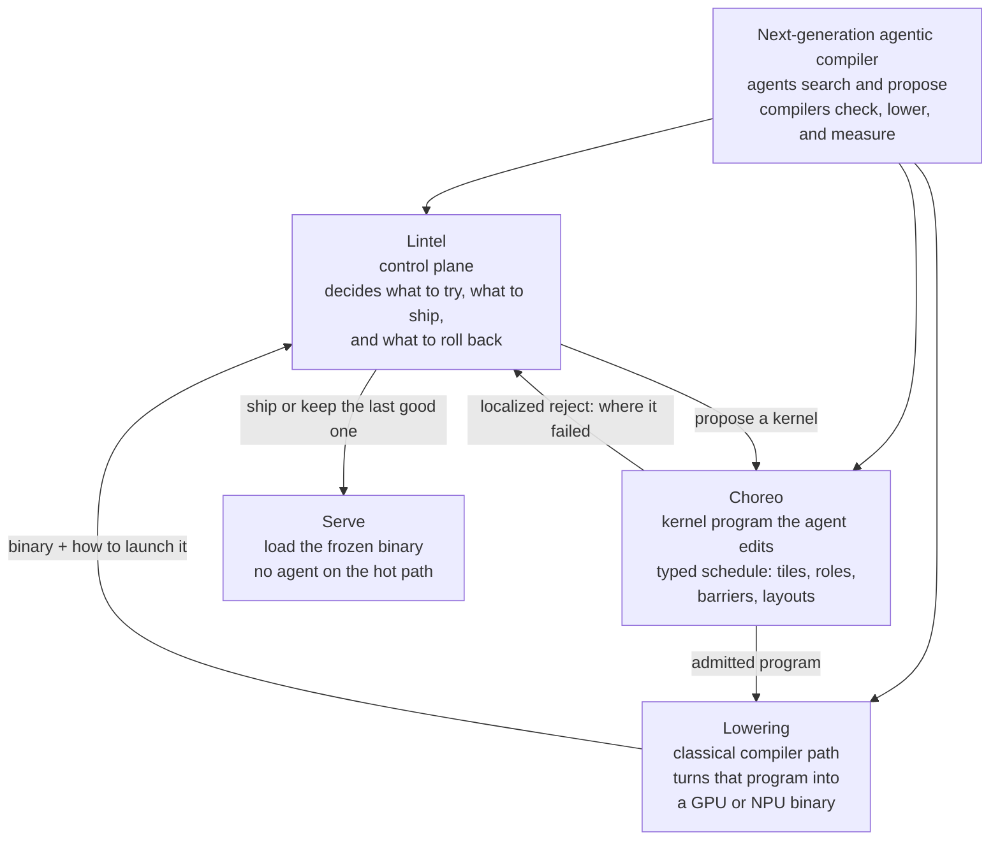

# Lintel

**Goal:** a next-generation **agentic compiler**. Agents search and propose. Compilers check, lower, and measure. Serve loads a frozen binary — no model on the hot path.

Lintel is the **control plane** of that compiler: what to try, what to ship, what to roll back. It is not a new `opt` / Inductor / Triton, and not a generic coding agent. The typed kernel the agent edits is **[Choreo](https://github.com/zackc6/choreo)**. Lowering is a classical **sink** (GPU cubin or NPU binary). Picture: [docs/ARCHITECTURE.md](docs/ARCHITECTURE.md).

This repository is a **year-1 plan** for that control plane (written v0 contract in `schemas/` / `examples/`). It does not run CI and it does not emit cubins. It does not fork [Cake](https://arxiv.org/abs/2608.12629) or [DeepSeek Harness](https://github.com/deepseek-ai/deepseek-harness). It takes Cake’s typed schedule + localized reject + evolving harness (Lintel runs the loop; compiler PRs land on `choreoir`) and DSH’s plugin seams + session log. Triton is the first printer, not the agent face. Evidence: [ai-compiler-survey](https://github.com/zackc6/ai-compiler-survey) (read in place; this repo does not copy it — that is hygiene, not the mission).

**Year-1 SKU.** CI/hot-path specialize on Amdahl-ranked kernels → layered admit → freeze a content-addressed artifact → serving A/B on one engine → classical fallback. Customer owns the artifact.

**What we refuse to sell in year 1.** “LLM replaces the compiler.” “Default-on for every build.” “One agent IR for all vendors.” Mid-walk compiler self-modify sold as T5. “Agentic compiler” without classical check/lower.

**Maintainer git.** Commit and push `main` directly. No feature branches, no PRs — see [`.cursor/skills/lintel/SKILL.md`](.cursor/skills/lintel/SKILL.md). This repo has no GitHub Actions.

## Start Monday

Week-1 decisions are in [docs/YEAR1.md](docs/YEAR1.md). Why this IR and the Acme walks: [docs/WHY.md](docs/WHY.md). The year-1 executable is [docs/POC.md](docs/POC.md) (control CFG+cost+ADG **and** Choreo Kernel AST). Not the linear v0 examples; not Cake IR; not Triton knobs.

| Path | What it is |
|---|---|
| [docs/WHY.md](docs/WHY.md) | Why the IR, what we benefit, Acme walks (L1–L7) |
| [docs/PRODUCT.md](docs/PRODUCT.md) | What we sell, and why Cake+DSH alone is the wrong SKU |
| [docs/ARCHITECTURE.md](docs/ARCHITECTURE.md) | Goal picture, seams, FSM, L1–L7 map |
| [docs/DATA_PLANE.md](docs/DATA_PLANE.md) | Choreo Kernel AST as year-1 L4; Triton is the printer |
| [docs/CHOREO.md](docs/CHOREO.md) | Verdict + vs Cake / Argus / TIRx / LLM-oriented IR; remaining Lintel work |
| [docs/LLM_IR.md](docs/LLM_IR.md) | New Compiler Stack taxonomy → Selector/stratum pins |
| [docs/LLM_ORIENTED_IR.md](docs/LLM_ORIENTED_IR.md) | Independent LLM-oriented IR survey (primary papers; not the other survey) |
| [docs/ADAPTERS.md](docs/ADAPTERS.md) | `adapter_id` table (live / stub / later) |
| [docs/YEAR1.md](docs/YEAR1.md) | Quarters, 10/25/50 staffing, week-by-week Q1, hiring order, GTM |
| [docs/MARKET.md](docs/MARKET.md) | Business value, unit economics, competitors over 1–3 years |
| [docs/RISKS.md](docs/RISKS.md) | Kill switches tied to survey checkpoints |
| [docs/SURVEY_MATCH.md](docs/SURVEY_MATCH.md) | Horizon A direction vs full stack; two-clock T5; L1–L7 search cut |
| [docs/SURVEY_MAP.md](docs/SURVEY_MAP.md) | Jobs, C1–C10, T1–T10, P1–P23 → year-1 choice |
| [docs/ADMIT_RECORD.md](docs/ADMIT_RECORD.md) | Annotated admit record (landed + reverted) |
| [docs/LINTEL_IR.md](docs/LINTEL_IR.md) | Lintel IR: land / revert / reject + cache_key |
| [docs/POC.md](docs/POC.md) | Year-1 hard kernel: CFG + cost + ADG + Choreo L4 |
| [docs/LATER.md](docs/LATER.md) | Coverage after PoC (`%w`, policy-hash, more edges, `@cake.v0` wrap) |
| `schemas/` | v0 linear + poc CFG/cost + adapter-proposal; admit record, session, cache key |
